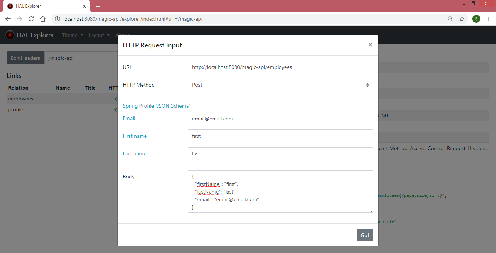

# Spring Data REST

[Spring Data REST](https://spring.io/projects/spring-data-rest)

[Spring Data REST Documentation](https://spring.io/projects/spring-data-rest#learn)

[Example : Accessing JPA Data with REST](https://spring.io/guides/gs/accessing-data-rest/)

---

##### `@RepositoryRestResource(path = "members")`
> if we want to expose a different resource name?
> instead of "/employees" (or default) to use "/members" (customized)
> so path will be http://localhost:8080/members

---
	
##### Pagination
* Default page size is 20
* Pages are zero based
* To navigate page 
    * [http://localhost:8080/employees?page=0](http://localhost:8080/employees?page=0)
    * [http://localhost:8080/employees?page=1](http://localhost:8080/employees?page=1)
* Properties
    * spring.data.rest.default-page-size=50
    * spring.data.rest.max-page-size=

##### To make default base path
* spring.data.rest.base-path=/magic-api

> Here, http://localhost:8080/magic-api will be default base path
	
##### Sorting
In Employee,we have firstName, lastName and email
* [http://localhost:8080/employees/?sort=lastName](http://localhost:8080/employees/?sort=lastName)
* [http://localhost:8080/employees/?sort=firstName,desc](http://localhost:8080/employees/?sort=firstName,desc)
* [http://localhost:8080/employees/?sort=lastName,firstName,asc](http://localhost:8080/employees/?sort=lastName,firstName,asc)
* [http://localhost:8080/magic-api/employees?sort=firstName,desc&page=3](http://localhost:8080/magic-api/employees?sort=firstName,desc&page=3)

---

[Adding Custom Details to Your ALPS Descriptions](https://docs.spring.io/spring-data/rest/docs/current/reference/html/#metadata.alps.descriptions)

---

##### The HAL Browser

[The HAL Browser](https://docs.spring.io/spring-data/rest/docs/current/reference/html/#tools)
* Spring Data REST HAL Browser is deprecated! Prefer the HAL Explorer (artifactId: spring-data-rest-hal-explorer)!

---
